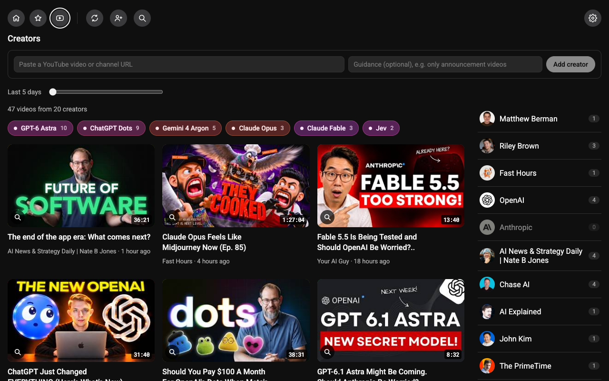

# AI News

A small web app that replaces a morning scroll through YouTube and X: one finite page of cards, each an entry point to something new in AI. Taste comes from a hand-picked list of YouTube creators and a short set of editorial guidelines; an agent (Anthropic API) does the searching.

It is also an experiment in building without frameworks (#21): a Node server and plain HTML, JS and CSS, with no runtime dependencies and no build step. `package.json`, `server.js` and `routes.js` are the three files to read first.

- The spec is issue #1.
- `docs/reference/prototype.html` is the working prototype of the feed page. Open it in a browser; it is the look and behaviour to match.

## Run it

Put `ANTHROPIC_API_KEY` and `YOUTUBE_API_KEY` in `.env.local` (see `.env.example`), then `node server.js` and open http://localhost:3000. Node 22.13 or newer; nothing to install. With no keys in the environment, the app asks for them in the browser and keeps them there.

- `pnpm dev` restarts the server when a file changes.
- `pnpm install` once, then `pnpm check` (types) and `pnpm test`. Both are for working on the code, not for running it.
- Data lives in `data/` (git-ignored); `DATA_DIR` moves it. `PORT` changes the port.
- Hosting (Railway): no Dockerfile; set the two keys or leave them out, and mount a volume at `DATA_DIR`. One instance only: refresh progress and the write queue live in memory.

## How TypeScript is used

Every file is plain JavaScript and runs exactly as written, in Node and in the browser. TypeScript never compiles anything here; it only reads the code and reports mistakes.

- **The shapes live in `types.d.ts`** (`Card`, `Creator`, `Settings` and the rest), written in ordinary TypeScript. They are global, so no file imports them.
- **A `.js` file points at a shape in a comment**, such as `@param {Card} card`. Most other types are inferred.
- **`pnpm check` runs the checker** over `server/`, `browser/` and `test/` (settings in `jsconfig.json`). Editors that understand TypeScript show the same errors as you type.
- **`typescript` and `@types/node` are the only packages**, and only the check needs them. Running the app needs neither.

## Status

**Focus:** nothing is in flight; pick from the parked list. (1) Sidecar keyboard: after a click on the video the arrow keys go to YouTube until the bar or History is clicked; the fix is to take focus back from the embed in `browser/player/frame.js`, at the cost of YouTube's own keys (re-add space for pause). Do it only if Josh says it bothers him. (2) After his next refresh, screenshot Home and make it the README's lead image (`docs/screenshots/`). (3) #17: the now-playing highlight on Home's card and snapping the window back are still open; its next/previous is done by the up and down keys. Cheaper stories beyond caching (fewer searches, a cheaper model, stories only on request) change the output and need his say first.

**Last shipped**
- Sidecar History is a fixed-center carousel (#30): the playing row sits at the column's middle, larger than the rest, and up and down slide the list under it, stopping at the ends. Delete (or Backspace) removes the playing video and moves on to the one below.
- Sidecar and Creators power moves, all listed in the guide on the Settings page: shift-click on Home queues a video under the one playing; a finished video starts the next unfinished row; up and down switch videos, left and right skip 10 seconds; a Chapters button (and C) lists chapters over History, with up and down walking them; on Creators, up and down cycle the picked creator.
- Cheaper story search: the lanes cache what they read, so each step re-reads earlier results at a tenth of the price, and a fetched page is capped at 8,000 tokens. Measured on two refreshes: $0.97 and $0.84, where the same work uncached would have cost $1.54 and $1.40. The server log line `[stories]` shows both numbers after every refresh.
- No frameworks, no runtime dependencies, no build (#21): Next, React, zod, the Anthropic SDK and vitest are gone. `server.js` + `routes.js` + `server/` serve plain pages from `browser/`. Keys come from `.env.local`, or from the browser when the server has none (Add your keys; Delete keys in Settings). `pnpm check` and `pnpm test` are the gate.
- YouTube comes from the official Data API (#21 stage 1): `YOUTUBE_API_KEY` is now required. Creator lists have exact dates and full descriptions; `youtubei.js` and the RSS feed are gone. A search costs 100 of the day's 10,000 units, everything else 1.
- Card dates read as an age while recent ("9 hours ago", "2 days ago", up to 28 days), then the date.

**Up next**
- Open issues.
